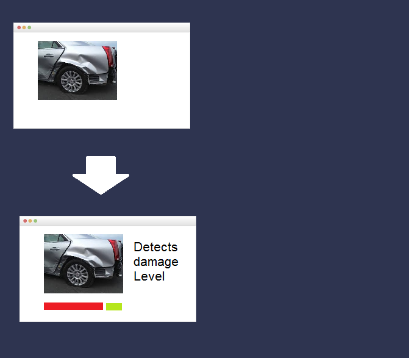
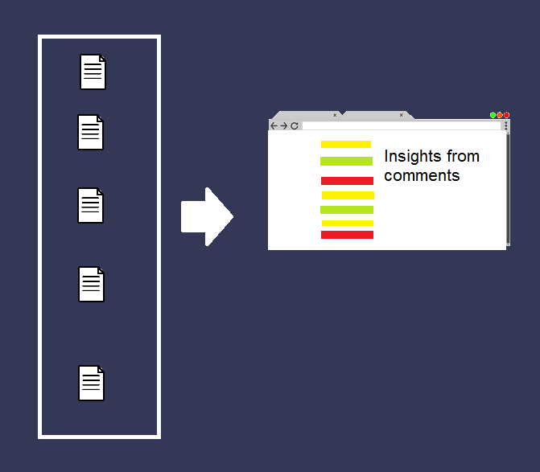
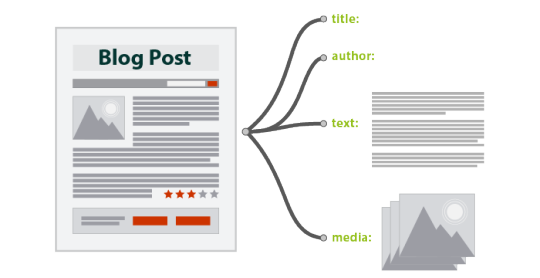

<!-- Main -->

<!-- One -->
<section id="one">
	

		<header class="major">
			<h2> Deployment Dashboard</h2>
		</header>
		
 In industry developers often face problem when testing team uses same database as developer team and data corruption occurs. To solve this problem, we developed a dashboard capable of doing automated continuous test build and deploy and continuously monitor the status of deployment. Here I learned about developing microservice architecture based ERP solutions and developed most of the skills necessary to be a full stack software developer. 

				<ul class="actions">
					<li><a href="https://prezi.com/p/lqlcf89yuebe" class="button">Have a look at this project</a></li>
				</ul>
	

</section>

<!-- Two -->
<section id="two" class="spotlights">
	<section>
		
		

			

				<header class="major">
					<h3>Car Damage Level Detector</h3>
				</header>
				
To automate manual inspection of Car in Car Insurance Companies Developed a module to detect level of damage in car from still car picture for a Car Insurance Company using Inception Net (A type of Neural Network). Here, I had learned lots of R&D and had hands on experience on Deep Learning and had hands on about Inception Neural Network Based Architecture

				
			

		

	</section>
	<section>
		
		

			

				<header class="major">
					<h3>Text Summarizer</h3>
				</header>
				
It is often become very huge process for BU leads to get the insights of company from the feedback given by the members of the company. To encounter this problem, we developed a platform to extract insights of company from given feedback using clustering algorithms like LSA or LDA. Here I had hands on experience in Machine Learning.

				
			

		

	</section>
	<section>
		
		

			

				<header class="major">
					<h3>AI based Document Parser</h3>
				</header>
				
To Automate Project Audit Process (Which is currently done manually) we developing a module which automates this whole process using Natural Language Processing, Deep Learning, Reinforcement Learning. Here I having a lot of hands on experience in these fields of Artificial Intelligence.

				
			

		

	</section>
</section>

<!-- Three -->
<section id="three">
	

		<header class="major">
			<h2>Side Projects and Interests</h2>
		</header>
		
Beside doing Deep Learning , Machine Learning related projects in my Office I have keen interest in Reinforcement Leraning and Genetic Algorithm 
		related work. Look into this section to have a idea about my work of interest also.

		<ul class="actions">
			<li><a href="all_posts.html" class="button next">Have a look at projects of my own interests</a></li>
		</ul>
	

</section>

